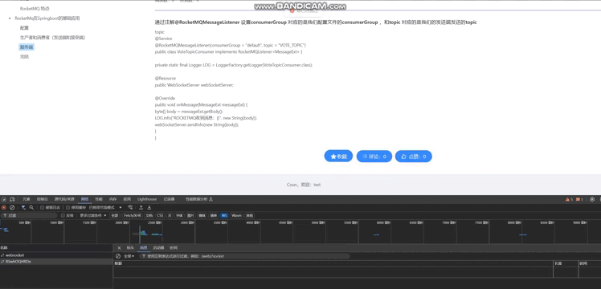

# netty-websocket-spring-boot 
## 效果示例



## 前言
该项目之前是基于`spring-boot-starter-websocket`做的一个Demo，start还不错，但由于Spring集成的WebSocket是由Tomcat集成的，并发量和效率有限，通过Netty来实现的效率会更高，由于Netty的网络模型、数据结构等优化。

## 介绍
基于Netty实现了大部分spring-websocket的功能，从下图能知道Spring-Websocket使用起来非常方便，但是性能方面相较于Netty实现的WebScoket性能会有
些差距，但是Netty做Websocket复杂度更高，为了让Netty实现WebSocket使用更简单，于是开发了这个starter,该starter使用起来可以和
spring-websocket一样简单，而且使用语法尽可能的和Spring-Websocket一致。

## 前端代码地址
https://github.com/KKJava1/Coun-Netty-Springboot-Vue3

## 使用

### 支持事件类型
| 事件   | 事件注解 | 应用场景 | 
|------|------|-----|
| 握手前  | @HandshakeBefore | 认证、鉴权 |
| 连接成功 | @OnOpen  | --  |
| 收到消息 | @OnMessage  | --  |
| 连接关闭 | @OnClose  |     |
| 异常   | @OnError  | 异常捕获 |
| 心跳超时 | @OnEvent  | 剔除失效连接 |

### 注解方法支持的参数类型
| 参数           | @HandshakeBefore | @OnOpen |  @OnClose |   @OnMessage | @OnEvent | @OnError | 
|--------------|---------------|-------------|------------|----------|----------|----------|
| HttpHeaders  | √  | √  |√  | √  | √ | √ |
| Session      | √  | √  |√  | √  | √  | √ |
| @PathParam   | √  |√  |√ | √ | √        | √|
| String(消息内容) | ×  | ×  |×  | √   | ×   | × |
| Throwable    | ×  | ×  |×  | ×  | ×   | √  |
| Object（事件）   |  ×  | ×  |×  | ×  |  √  | × |


```java
@WsServerEndpoint(value = "/socketServer/{userid}")
@Component
@Slf4j
public class SocketServer {

    private static ConcurrentMap<String,Session> sessionPool = new ConcurrentHashMap<>();
    private static ConcurrentMap<String,String> sessionIds = new ConcurrentHashMap<>();

    private static final String ADMIN = "niezhiliang9595";

    @HandshakeBefore
    public void handshakeBefore(HttpHeaders headers,@PathParam String userid) {
        log.info("handshakeBefore userId: {}  host: {}", userid, headers.get("HOST"));
    }

    /**
     * 用户连接时触发
     * @param session
     * @param userid
     */
    @OnOpen
    public void open(Session session,@PathParam(value="userid") String userid){
        log.info("client【{}】连接成功",userid);
        sessionPool.put(userid, session);
        sessionIds.put(session.getId(), userid);
    }

    /**
     * 收到信息时触发
     * @param message
     */
    @OnMessage
    public void onMessage(Session session,String message){
        String msg = String.format("%s  <-- %s",sessionIds.get(session.getId()),message);
        sendMessage(msg,ADMIN);
        log.info("client {} send to ADMIN  message : {} ",sessionIds.get(session.getId()),message);
    }

    /**
     * 连接关闭触发
     */
    @OnClose
    public void onClose(Session session,@PathParam String userid){
        sessionPool.remove(sessionIds.get(session.getId()));
        sessionIds.remove(session.getId());
        log.info("client【{}】断开连接",userid);
    }

    /**
     * 发生错误时触发
     * @param session
     * @param error
     */
    @OnError
    public void onError(Session session, Throwable error) {
        error.printStackTrace();
    }

    /**
     * 发生事件时触发
     * @param session
     * @param evt
     */
    @OnEvent
    public void onEvent(Session session,@PathParam String userid, Object evt) {
        if (evt instanceof IdleStateEvent) {
            IdleStateEvent idleStateEvent = (IdleStateEvent) evt;
            switch (idleStateEvent.state()) {
                case READER_IDLE:
                    log.info("clent : {} heartbeat read timeout event",userid);
                    break;
                case WRITER_IDLE:
                    log.info("clent : {} heartbeat write timeout event",userid);
                    session.close();
                    break;
                case ALL_IDLE:
                    log.info("clent : {} heartbeat all timeout event",userid);
                    break;
                default:
                    break;
            }
        }
    }

    /**
     *信息发送的方法
     * @param message
     * @param userId
     */
    public static void sendMessage(String message,String userId){
        Session s = sessionPool.get(userId);
        if(s!=null){
            s.sendText(message);
        }
    }

    /**
     * 获取当前连接数
     * @return
     */
    public static int getOnlineNum(){
        if(sessionIds.values().contains(ADMIN)) {

            return sessionPool.size()-1;
        }
        return sessionPool.size();
    }

    /**
     * 获取在线用户名以逗号隔开
     * @return
     */
    public static String getOnlineUsers(){
        StringBuffer users = new StringBuffer();
        for (String key : sessionIds.keySet()) {//ADMIN是服务端自己的连接，不能算在线人数
            if (!ADMIN.equals(sessionIds.get(key))) {
                users.append(sessionIds.get(key)+",");
            }
        }
        return users.toString();
    }

    /**
     * 信息群发
     * @param msg
     */
    public static void sendAll(String msg) {
        for (String key : sessionIds.keySet()) {
            if (!ADMIN.equals(sessionIds.get(key))) {
                sendMessage(msg, sessionIds.get(key));
            }
        }
    }

    /**
     * 多个人发送给指定的几个用户
     * @param msg
     * @param persons  用户s
     */

    public synchronized static void SendMany(String msg,String [] persons) {
        for (String userid : persons) {
            sendMessage(msg, userid);
        }

    }
}

```

## 收获
- Netty
- 自定义注解修饰Bean，并注入容器
- 扫描并回调自定义注解修饰方法
- 自动装配Starter
- 后置处理器`SmartInitializingSingleton`
- 适配器模式
- 方法参数解析
- 路由匹配、请求路由参数获取


